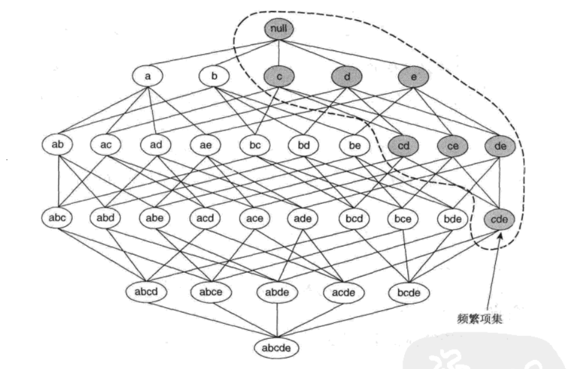

# 第1章 实验目的

利用Kaggle上的Groceries dataset数据集，通过Apriori算法，实现基本的关联规则挖掘，并设置不同的支持度和置信度阈值，感受剪枝速度带来的差异。同时通过将Hash Tree数据结构嵌入Apriori类支持度计数索引的过程，理解Hash Tree相比逐项搜索带来的效率上升。

# 第2章 算法描述和分析

## 2.1 频繁项集的产生

Apriori（先验）算法采用的是一种“特殊到一般”的思想，它开创性地使用基于支持度的剪枝技术，系统地控制候选项集指数增长。

   ***先验原理\*** *如果一个项集是频繁的，则它的所有子集一定也是频繁的。*

​                               

图1 先验原理，如果{c, d, e}是频繁的，则它的所有子集也频繁[1]

如图1所示的项集格。假定{c, d,e}是频繁项集。显而易见，任何包含项集{c,d,e}的事务一定包含它的子集{c, d }, {c, e},{d, e}, {c}，{d }和{e}。这样，如果{c, d,e }是频繁的，则它的所有子集（图1中的阴影项集）一定也是频繁的。

 

图2 基于支持度的剪枝,如果{a,b}是非频繁的，则它的所有超集也非频繁[1]

相反，如果项集{a,b)是非频繁的，则它的所有超集也一定是非频繁的。如图2所示，一旦发现{a,b}是非频繁的，则整个包含{a,b}超集的子图可以被立即剪枝。这种基于支持度度量修剪指数搜索空间的策略称为基于支持度的剪枝( support-based pruning)。这种剪枝策略依赖于支持度度量的一个关键性质，即一个项集的支持度决不会超过它的子集的支持度。这个性质也称支持度度量的反单调性（anti-monotone）。

表1 频繁项集产生伪代码

 

表1中给出了Apriori算法产生频繁项集部分的伪代码。令C为候选k-项集的集合，而F为频繁k-项集的集合：

(1)   该算法初始通过单遍扫描数据集，确定每个项的支持度。一旦完成这一步，就得到所有频繁1-项集的集合F(步骤1和步骤2)。

(2)   接下来，该算法将使用上一次迭代发现的频繁(k-1)-项集，产生新的候选k-项集(步骤5)。 

(3)   为了对候选项的支持度计数，算法需要再次扫描一遍数据集（步骤6~10)。使用子集函数确定包含在每一个事务t中的C中的所有候选k-项集。

(4)   计算候选项的支持度计数之后，算法将删去支持度计数小于minsup的所有候选项集（步骤12)。

(5)   当没有新的频繁项集产生，即F=时，算法结束（步骤13)。

值得一提的是，本实验中由频繁(k-1)-项集，产生新的候选k-项集时采用的方法为Fk-1×Fk-1方法，即由频繁(k-1)-项集自连接产生，当且仅当它们的前k-2个项都相同。令A = {a1, a2, …, ak-1}和B= {b1, b2, …, bk-1}是一对频繁(k-1)-项集，合并A和B，如果它们满足如下条件:

ai= bi (i =1, 2,…,  k-2)并且 ak-1≠ bk-1

在图3中，频繁项集{面包，尿布}和{面包，牛奶}合并，形成了候选3-项集{面包，尿布，牛奶}。算法不会合并项集{啤酒，尿布}和{尿布，牛奶}，因为它们的第一个项不相同。实际上，如果{啤酒，尿布，牛奶}是可行的候选，则它应当由{啤酒，尿布}和(啤酒，牛奶}合并而得到。这个例子表明候选项产生过程的完全性和使用字典序避免重复的候选的优点。然而，由于每个候选都由一对频繁(k-1)-项集合并而成，因此需要附加的候选剪枝步骤来确保该候选的其余k-2个子集是频繁的。

 

图3 通过合并一对频繁(k-1)-项集生成和剪枝候选k-项集

## 2.2 规则的产生

计算关联规则的置信度不需要再次扫描事务数据集。考虑规则{1,2}→{3}，它是由频繁项集X={1,2,3}产生的。该规则的置信度为σ({1,2,3})/σ({1,2})。因为{1,2,3}是频繁的，支持度的反单调性确保项集{1，2}一定也是频繁的。由于这两个项集的支持度计数已经在频繁项集产生时得到，因此不必再扫描整个数据集。

*如果规则**X**→* *Y~X**不满足置信度阈值**,**则形如**X'**→* *Y-X'**的规则一定也不满足置信度阈值，其中**X'**是**X**的子集。*

  Apriori算法使用一种逐层方法来产生关联规则，其中每层对应于规则后件中的项数。初始,提取规则后件只含一个项的所有高置信度规则，然后，使用这些规则来产生新的候选规则。例如，如果{acd }→{b}和{abd}→{c}是两个高置信度的规则,则通过合并这两个规则的后件产生候选规则{ad }→{bc}。图4显示了由频繁项集{a, b, c,d}产生关联规则的格结构。如果格中的任意结点具有低置信度，则根据定理，可以立即剪掉该结点生成的整个子图。假设规则{bcd}→{a}具有低置信度，则可以丢弃后件包含a的所有规则，包括{cd}→{ab}, {bd}→{ac), {bc}→{ad}和{(d}→{abc}。

 

图4 使用置信度度量对关联规则进行剪枝

表2 强关联规则产生伪代码


 

# 第3章 实验数据


## 3.1 数据来源

数据来自Kaggle上的Groceries dataset，包含了38765条记录。

```python
import numpy as np 

import pandas as pd

df=pd.read_csv("Groceries_dataset.csv")

df.info()

df.head()
```

```
<class 'pandas.core.frame.DataFrame'>
RangeIndex: 38765 entries, 0 to 38764
Data columns (total 3 columns):
 #   Column           Non-Null Count  Dtype 
---  ------           --------------  ----- 
 0   Member_number    38765 non-null  int64 
 1   Date             38765 non-null  object
 2   itemDescription  38765 non-null  object
dtypes: int64(1), object(2)
memory usage: 908.7+ KB
```

| Member_number | Date       | itemDescription  |
| ------------- | ---------- | ---------------- |
| 1808          | 21-07-2015 | tropical fruit   |
| 2552          | 05-01-2015 | whole milk       |
| 2300          | 19-09-2015 | pip fruit        |
| 1187          | 12-12-2015 | other vegetables |
| 3037          | 01-02-2015 | whole milk       |

第一个字段为顾客编号，第二个字段为交易日期，第三个字段为商品。


 

## 3.2 读取数据

```python
 transactions = df.groupby(['Member_number', 'Date'])['itemDescription'].apply(list).tolist()
```

按照会员编号和日期对数据进行分组。这意味着，对于每个会员在每个日期的购物行为，我们都将其视为一个独立的交易。从每个分组中提取itemDescription列，这列包含了在该交易中购买的商品。这样处理后，transactions 变量就是一个列表的列表，每个内部列表代表一个交易中的所有商品

# 第4章 程序实现技术技巧的介绍和分析

## 4.1 哈希树

使用的数据集有38765条记录，在进行支持度计数时如果使用枚举法将会频繁对数据集进行扫描，会大大增加运行的速度，因此我们使用哈希数(Hash Tree)这种数据结构来提升索引的速率。

在Apriori算法中，候选项集划分为不同的桶，并存放在Hash树中。在支持度计数期间，包含在事务中的项集也散列到相应的桶中。这种方法不是将事务中的每个项集与所有的候选项集进行比较，而是将它与同一桶内候选项集进行匹配，如图5所示。

 

图5 使用Hash树结构的项集支持度计数

图6是一棵Hash树结构的例子。树的每个内部结点都使用Hash函数h(p)= p mod 3来确定应当沿着当前结点的哪个分支向下。例如，项1，4和7应当散列到相同的分支（即最左分支)，因为除以3之后它们都具有相同的余数。所有的候选项集都存放在Hash树的叶结点中。图6中显示的Hash树包含15个候选3-项集，分布在9个叶结点中。

在本实验中，经过对Kaggle网站上已有实验的数据，至多有频繁3-项集，因此哈希函数也使用h(p)= p mod 3。

 

图6 在Hash树的根结点散列一个事务

```python
class HashTreeNode:
    def __init__(self, depth=0):
        self.depth = depth
        self.children = {}
        self.is_leaf = True
        self.items = []

    def insert(self, itemset):
        if self.depth == len(itemset):
            self.items.append(itemset)
            return

        key = hash(itemset[self.depth]) % 3
        if key not in self.children:
            self.children[key] = HashTreeNode(self.depth + 1)

        self.children[key].insert(itemset)

    def get_itemsets(self, transaction, itemsets):
        if self.is_leaf:
            for item in self.items:
                if item.issubset(transaction):
                    itemsets.add(item)
            return

        key = hash(transaction[self.depth]) % 3
        if key in self.children:
            self.children[key].get_itemsets(transaction, itemsets)

```


## 4.2 Apriori类

通过逐级构建候选项集，并利用先前级别的频繁项集来减少候选项集的数量：一个项集是频繁的，当且仅当它的所有子集也是频繁的。

```python
class Apriori:
    def __init__(self, transactions, min_support, min_confidence):
        self.transactions = transactions
        self.min_support = min_support
        self.min_confidence = min_confidence
        self.item_set = self.get_item_set()
        self.frequent_itemsets = {}
        self.rules = []

    def get_item_set(self):
        item_set = set()
        for transaction in self.transactions:
            for item in transaction:
                item_set.add(frozenset([item]))
        return item_set

    def run(self):
        k = 1
        current_l_set = self.item_set
        while current_l_set:
            self.frequent_itemsets[k] = current_l_set
            current_l_set = self.join_set(current_l_set, k)
            current_l_set = self.get_support(current_l_set)
            k += 1

        self.generate_rules()

    def join_set(self, item_set, k):
        return set([i.union(j) for i in item_set for j in item_set if len(i.union(j)) == k + 1])

    def get_support(self, item_set):
        hash_tree = HashTreeNode()
        for item in item_set:
            hash_tree.insert(item)

        item_count = defaultdict(int)
        for transaction in self.transactions:
            matching_itemsets = set()
            hash_tree.get_itemsets(transaction, matching_itemsets)
            for item in matching_itemsets:
                item_count[item] += 1

        return set(item for item in item_count if item_count[item] >= self.min_support * len(self.transactions))

    def generate_rules(self):
        for key, value in self.frequent_itemsets.items():
            if key == 1:
                continue
            for item_set in value:
                _subsets = [frozenset(x) for r in range(1, len(item_set)) for x in combinations(item_set, r)]
                for element in _subsets:
                    remain = item_set.difference(element)
                    if remain:
                        confidence = self.get_confidence(element, item_set)
                        if confidence >= self.min_confidence:
                            self.rules.append((element, remain, confidence))

    def get_confidence(self, subset, parent_set):
        parent_support = self.get_item_support(parent_set)
        subset_support = self.get_item_support(subset)
        return parent_support / subset_support

    def get_item_support(self, item):
        support = 0
        for transaction in self.transactions:
            if item.issubset(transaction):
                support += 1
        return support / len(self.transactions)
```


## 4.3 主函数

为了查看程序的时间和空间消耗，调用time库和sys库：

```python
import time
import sys
```

并打印出频繁k-项集以及关联规则：

```python
if __name__ == '__main__':
    # 加载数据
    file_path = 'Groceries_dataset.csv'
    groceries_data = pd.read_csv(file_path)
    # 按会员编号和日期分组，然后创建交易列表
    transactions = groceries_data.groupby(['Member_number', 'Date'])['itemDescription'].apply(list).tolist()

    # 创建Apriori实例
    apriori_instance = Apriori(transactions, min_support=0.01, min_confidence=0.1)

    # 测量运行时间
    start_time = time.time()

    # 运行Apriori算法
    apriori_instance.run()

    end_time = time.time()

    # 打印生成的规则
    print("关联规则:")
    for rule in apriori_instance.rules:
        antecedent = ', '.join(rule[0])  # 将前件转换为逗号分隔的字符串
        consequent = ', '.join(rule[1])  # 将后件转换为逗号分隔的字符串
        confidence = rule[2]             # 置信度
        print(f"({antecedent}, {consequent}, confidence={confidence})")
    print_frequent_itemsets(apriori_instance.frequent_itemsets)

    print("运行时间:", end_time - start_time, "秒")

    # 测量内存消耗
    print("大致内存消耗:", sys.getsizeof(apriori_instance), "字节")

    # 计算运行时间
    execution_time = end_time - start_time

    # 估计内存消耗
    memory_usage = sys.getsizeof(apriori_instance)
```


# 第5章 实验结果、结果分析和实验结论

在一块AMD EPYC 7302的云服务器（Ubuntu20.04）上完成训练。

min_support=0.01, min_confidence=0.1运行结果

```python
频繁项集:
长度为 1 的频繁项集:
specialty chocolate
pork
salad dressing
soda
canned fruit
hard cheese
cleaner
hygiene articles
sweet spreads
dish cleaner
baking powder
onions
zwieback
liquor
processed cheese
rubbing alcohol
cling film/bags
cat food
potato products
dental care
flower soil/fertilizer
shopping bags
jam
meat spreads
white bread
pot plants
frozen dessert
cooking chocolate
chicken
sausage
whipped/sour cream
condensed milk
sugar
cookware
organic products
butter
butter milk
whisky
dessert
liquor (appetizer)
whole milk
liqueur
honey
rum
bottled water
detergent
frozen vegetables
frozen chicken
oil
ham
liver loaf
flower (seeds)
canned fish
red/blush wine
tea
cocoa drinks
male cosmetics
roll products
spread cheese
canned vegetables
photo/film
ketchup
abrasive cleaner
rolls/buns
white wine
pickled vegetables
soups
Instant food products
dog food
make up remover
citrus fruit
canned beer
bottled beer
candles
misc. beverages
female sanitary products
house keeping products
organic sausage
napkins
bags
margarine
vinegar
brandy
softener
UHT-milk
cream
chocolate marshmallow
popcorn
long life bakery product
finished products
meat
kitchen utensil
beverages
coffee
pastry
mustard
specialty bar
beef
seasonal products
toilet cleaner
curd cheese
herbs
dishes
salt
ice cream
instant coffee
preservation products
nuts/prunes
salty snack
curd
tropical fruit
cream cheese
ready soups
syrup
cereals
frozen fruits
semi-finished bread
skin care
newspapers
tidbits
mayonnaise
spices
bathroom cleaner
sparkling wine
decalcifier
baby cosmetics
nut snack
pip fruit
yogurt
root vegetables
candy
pasta
waffles
packaged fruit/vegetables
berries
soap
pudding powder
chewing gum
domestic eggs
grapes
brown bread
sauces
frozen potato products
soft cheese
sliced cheese
flour
artif. sweetener
hamburger meat
snack products
prosecco
specialty vegetables
pet care
turkey
kitchen towels
specialty cheese
cake bar
rice
frozen meals
fish
other vegetables
frankfurter
fruit/vegetable juice
light bulbs
hair spray
frozen fish
specialty fat
chocolate
长度为 2 的频繁项集:
whole milk, soda
whole milk, other vegetables
whole milk, rolls/buns
whole milk, yogurt
other vegetables, rolls/buns

关联规则:
(soda -> whole milk, confidence=0.12)
(other vegetables -> whole milk, confidence=0.12)
(rolls/buns -> whole milk, confidence=0.13)
(yogurt -> whole milk, confidence=0.13)

运行时间: 40.25232529640198 秒
估计内存消耗: 48 字节
```


# 第6章 小结

通过这个实验，我复现了第一个关联规则挖掘算法Aporior，今年2023年全国大学生数学建模竞赛时，我们小组也遇到了关联规则挖掘的问题，当可惜当时还没有接触数据挖掘，因此当时的做法是用图结构实现层次聚类，没有用到支持度、置信度等概念，所以现在看来结果也不可信。

通过这次实验，我也了解到了FP树等其他关联规则挖掘算法，同时也了解了PageRank等基础推荐算法。

# 参考文献

[1]数据挖掘导论, Pang-Ning Tan, Michael Steinbach, Vipin Kumar著, 范明, 范宏建等译, 人名邮电出版社[M]. 2011年1月第2版:201-216.